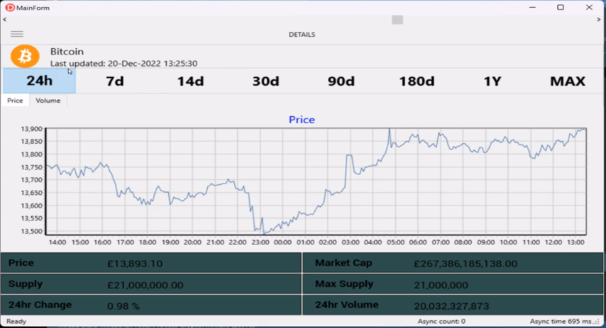

# CryptoFMX
### Sample Delphi Programming - showing REST/PPL/FMX using www.coingecko.com api.
 
 

#### USES
* Delphi Community edition 10.4. Download at [Delphi Community edition ](https://www.embarcadero.com/products/delphi/starter/free-download/)
* REST/JSON -> [CoinGecko API]('https://api.coingecko.com/api/v3/') to obtain crypto details.
* [DEB Event Bus framework for Delphi](https://github.com/spinettaro/delphi-event-bus) 
* TeeChart Components, avaliable with Delphi Community edition.

### Some useful References 
* [Parallel Programming Library](https://docwiki.embarcadero.com/RADStudio/Sydney/en/Using_the_Parallel_Programming_Library)
* [Delphi-event-bus](https://github.com/spinettaro/delphi-event-bus)
* [Managed Records](https://docwiki.embarcadero.com/RADStudio/Sydney/en/Custom_Managed_Records)
* [Managed Records articles ](https://blog.grijjy.com/2020/08/03/automate-restorable-operations-with-custom-managed-records/)
* [System.TMonitor](https://docwiki.embarcadero.com/Libraries/Sydney/en/System.TMonitor)
* [Delphi: Wait for threads to finish](https://stackoverflow.com/questions/33345396/delphi-wait-for-threads-to-finish)

### Few Hightlights
* TTasks/PPL for _asynchronous tasks_, reducing impacting on main UI thread.
* Event Bus used to coordinate and pass data from completed _asynchronous tasks_ with main UI, both for
    * User initiated events 
    * Timer events which polls for periodic updates.
* Interfaces used to separate concerns and reflect state.
* Managed Records.
* TMonitor used as a precaution to protect data. Although adopted cloning data as opposed to Sharing/Locking.
* Functions that return futures.
* Keeps a count of async tasks running. Prevents Application from closing while threads are active. _ie stop a TTask outliving the application_. 
* Animated scroll bar used to indocate load on main UI.

### Status 
    Just needs a final tidy up.

