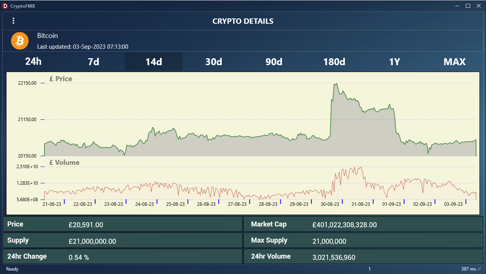

## CryptoFMX

#### Sample basic Delphi Program (Windows) - using REST/PPL/FMX 
##### using www.coingecko.com api.

#### USES 
* Delphi Community Edition 11.3 [Delphi Community edition ](https://www.embarcadero.com/products/delphi/starter/free-download/)
* REST/JSON -> [CoinGecko API]('https://api.coingecko.com/api/v3/') to obtain crypto details.
* No Third Party dependencies.
* TTasks/PPL for _asynchronous tasks_, reducing impacting on UI thread.
* Simple Timer to update details periodically. keeping the code lightweight.
* NOTE Progress wheel displays when an async operation active, but the main UI responsive.

### Some useful References 
* [Parallel Programming Library](https://docwiki.embarcadero.com/RADStudio/Sydney/en/Using_the_Parallel_Programming_Library)
* [Managed Records](https://docwiki.embarcadero.com/RADStudio/Sydney/en/Custom_Managed_Records)
* [Managed Records articles ](https://blog.grijjy.com/2020/08/03/automate-restorable-operations-with-custom-managed-records/)
* [System.TMonitor](https://docwiki.embarcadero.com/Libraries/Sydney/en/System.TMonitor)
* [Delphi: Wait for threads to finish](https://stackoverflow.com/questions/33345396/delphi-wait-for-threads-to-finish)

### Status 
* Ongoing. 